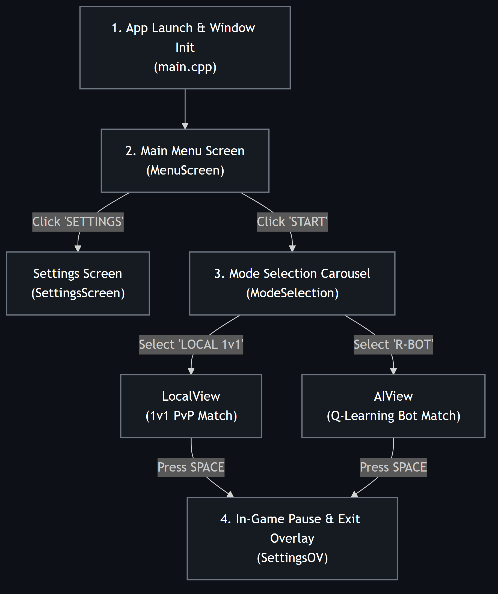
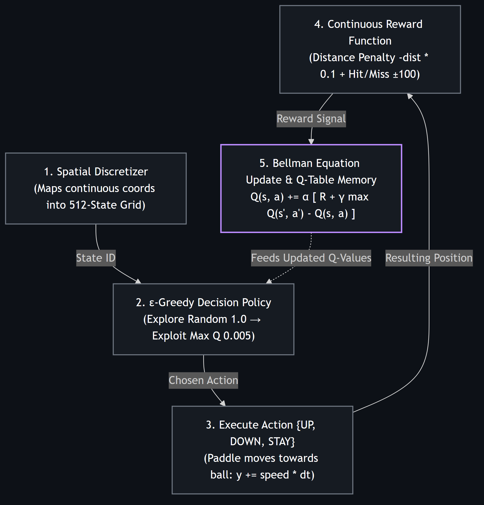
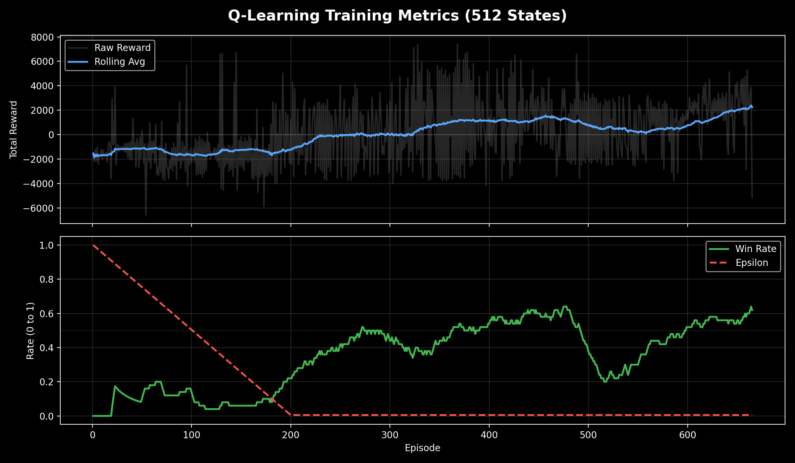

# vStrike — Action-RPG Battle Pong with Reinforcement Learning AI

[](https://pixelsmoothie.github.io/vStrike/)

[](https://en.wikipedia.org/wiki/C%2B%2B17)
[](https://webassembly.org/)
[](https://www.raylib.com/)
[](https://cmake.org/)
[](https://opensource.org/licenses/MIT)

> **🎮 Live Browser Demo:** Play against the Q-Learning AI directly in your browser at **[pixelsmoothie.github.io/vStrike](https://pixelsmoothie.github.io/vStrike/)** (Cross-compiled from C++17 to WebAssembly via Emscripten).

A 2D Action-RPG Battle Pong game developed in C++17 with Raylib, featuring combat mechanics, health pools, dynamic state navigation, and an adaptive AI opponent powered by a custom Tabular Q-Learning engine.

---

## Game Overview & Features

- **Combat Pong Mechanics:** Health-based scoring system, velocity multipliers, and dynamic collision response.
- **Game Modes:** Local 1v1 multiplayer and VS AI battle modes.
- **UI & State Management:** Custom screen state machine (`GameScreen`, `GameStates`) with smooth scene transitions.
- **Adaptive Reinforcement Learning AI:** An opponent agent trained via Q-Learning that learns trajectory prediction, positioning, and rally defense through self-play.

### Screen Navigation & State Flow


---

## AI Architecture (Tabular Q-Learning)

The AI opponent is implemented from scratch in pure C++ without external machine learning dependencies, using an `std::unordered_map` Q-Table.

### Q-Learning Closed Loop


### 1. State Space Discretization (512 States)
To avoid the continuous state-space explosion on an 800x1000 resolution, the continuous coordinate space is discretized into 512 discrete states:

$$\text{State ID} = (\text{Ball}_X) + (\text{Ball}_Y \times 4) + (\text{Paddle}_Y \times 32) + (\text{Dir}_X \times 256)$$

- **Ball X:** 4 spatial columns
- **Ball Y:** 8 spatial rows
- **Paddle Y:** 8 spatial rows
- **Ball Direction X:** 2 binary states (moving left / right)

### 2. Bellman Update Formulation
Q-values update on each state transition using the standard temporal difference formulation:

$$Q(s, a) \leftarrow Q(s, a) + \alpha \left[ R + \gamma \max_{a'} Q(s', a') - Q(s, a) \right]$$

- **Learning Rate ($\alpha$):** `0.1`
- **Discount Factor ($\gamma$):** `0.9`
- **Exploration Rate ($\epsilon$):** Decays by `0.005` per episode ($1.0 \rightarrow 0.005$)

### 3. Continuous Reward Shaping
To resolve the sparse reward problem of terminal win/loss conditions, the agent receives frame-by-frame continuous distance feedback:

$$R_{\text{dense}} = - \left( |\text{Paddle}_{\text{center}} - \text{Ball}_Y| \times 0.1 \right)$$
$$R_{\text{terminal}} = +100 \text{ (Hit / Scoring)}, \quad -100 \text{ (Missed Rally)}$$

---

## Empirical Results

Telemetry logged during training sessions shows convergence from random initial exploration to consistent rally defense across 450+ episodes:



| Training Phase | Episodes | Epsilon ($\epsilon$) | Win Rate | Average Reward |
|---|---|---|---|---|
| **Initial Exploration** | 1 – 50 | $1.00 \rightarrow 0.75$ | **0%** | $-1500 \text{ to } -2400$ |
| **Policy Formulation** | 51 – 200 | $0.75 \rightarrow 0.01$ | **~30%** | $+500 \text{ to } +2000$ |
| **Convergence** | 201 – 450+ | $0.005$ | **~75%** | **$+2500 \text{ to } +5350$** |

---

## Tech Stack & Project Architecture

- **Language:** C++17
- **Graphics & Audio:** Raylib 5.0
- **Build System:** CMake $\ge$ 3.20 + Ninja
- **Analytics:** Python 3 (Pandas, Matplotlib)

### Directory Structure
```
vStrike/
├── core/                   # Game loops, state views, and RL Brain
│   ├── aiView.h
│   ├── gameView.h
│   ├── localView.h
│   └── qBrain.h
├── entities/               # Game objects (Paddle, Ball)
├── physics/                # Collision resolution and kinematic rules
├── global/                 # State management, fonts, constants
├── UI/                     # UI components, health bars, shaders
└── data_vizualization/     # Performance metrics and analysis scripts
```

---

## Building and Running

### Prerequisites
- CMake $\ge 3.20$
- Modern C++ compiler (`g++`, `clang++`, or MSVC with C++17 support)

### Build
```bash
# Clone repository
git clone https://github.com/pixelsmoothie/vStrike.git
cd vStrike

# Configure and build
cmake -B build -S .
cmake --build build --config Release

# Run
./build/PongArena
```

---

## Roadmap

- [x] Modern C++17 Battle Pong Arena with Raylib 5.0
- [x] Custom Tabular Q-Learning Engine (512 States)
- [x] Per-Episode Metrics Telemetry and Analysis
- [ ] Automated Unit Testing Suite (Physics Engine & Bellman Update Math)
- [ ] In-Game Real-Time Performance Dashboard
- [ ] Networked Multiplayer (Client-Server UDP Architecture with Prediction)

---

## License
Distributed under the MIT License. See `LICENSE` for details.
